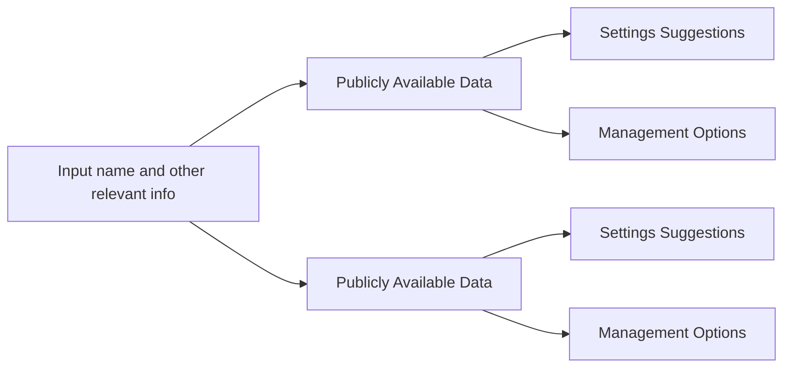

# Cyber Matters

## 3. A potential privacy management application

In this post, I'm going to talk about a tool that I think could be helpful in managing one's digital footprint—one that I'm going to be working on a prototype of throughout the rest of this blog. The idea is simple: what if there were a single tool you could go to that would compile and display all of the information about you that one can find on the Internet, as well as strategies and opportunities to minimize (or at least change) the size of that digital footprint? 

Ideally, it would work something like this. The user would input data like their name, state, etc., and would get back a list of the kinds of data that are available about them online, divided into categories like social media, home and mailing addresses, financial data, etc. Then, the application would recommend relevant privacy settings that might change the availability of that data, as well as allow for other data management options like takedown requests. 

This is definitely a tool that I would use to scope out my own digital footprint, and I think it could be a valuable way to manage things like social media settings if social media companies provide APIs to enable this kind of programmatic privacy management. Of course, it remains to be seen if their APIs do, in fact, allow for this kind of access. 