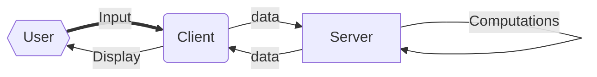

# Cyber Matters

## 4. Web Applications 

#### Disclaimer:

​	This post will be a bit more technical than the previous three. I'll try to make it as high-level as possible and add relevant links where I can, but the reality is that it's hard to build a web application without talking about what web applications are or how they're built, so I'll get that over with as quickly as possible in this post so we can spend more time on the fun stuff later. 

#### The Nitty-Gritty:

I'm planning to use [Flask](https://github.com/pallets/flask) and [Vue.js](https://vuejs.org/) to create a client-server web application which will allow a user to enter information into a search portal, which will send the information to a back-end server that will crawl social media networks and databases for more information about that person. Then, the server will send whatever it finds back to the client, which will display it in a nice, digestible format. 

If you didn't follow much of that, here's a nice diagram which shows off how simple this client-server model really is. All it's doing is separating the input and display logic, run on the client, from the actual computation and manipulation of data, done on the server. Most modern services run on some form of a client-server pattern–email, for example, generally separates the storage of emails from the displaying and sending parts of the email workflow. 

In this case, the input is user data like name, home state, etc., while the displayed data will be things like social media posts and profiles, address, government records, tax information, so on. 

#### A brief digression into APIs

For my first pass at this project, I'm going to stick to only two very limited sources of information. The first will be voting registration information from the state of North Carolina (my home state, among other advantages), and the second will be data from Twitter. Why these two? In a word: access. First, voter registration data in North Carolina is publicly available and posted regularly by the government online. I was able to find one massive file with almost all of the public record data NC collects on its voters on the website of the [Abdul Latif Jameel Poverty Action Lab](https://www.povertyactionlab.org/admindatacatalog/north-carolina-voter-records). It would also have been easy to get in touch with the the state board of elections at [elections.sboe@ncsbe.gov](elections.sboe@ncsbe.gov) and make a more formal request for this data. Most states offer some form of voter data publicly, but North Carolina is one of only a few which actively and regularly post this data online (there's an interesting privacy question there over whether states should try their hardest to make these data difficult to access in the name of privacy, but we'll save that for another time). 

Twitter offers unique advantages in comparison with other social media websites because it has a very permissive API. APIs, or Application Programming Interfaces, are some of the unsung heroes of modern computer science, but strangely, you're not likely to hear much about them unless you study computer science at a university. Luckily, they're really very simple. An API is a set of rules governing communication between computers or parts of a computer system. Think about it this way: say you have a gumball machine where you put in a dime and get out a gumball. That's a very, very basic form of an API. An API is a kind of agreement or specification which tells you what you have to put in (send) a server in order to get certain outputs. Maybe you send an HTTP GET request (not important to understand what that is, but [here's](https://www.codecademy.com/articles/http-requests) a link if you're interested) to a website, and it sends you back the content of the website. In fact, that's how your browser works. Importantly, APIs allow computers to communicate programmatically because they make it easy to know exactly how to get whatever information you want. 

That leads me to the importance of the Twitter API. Some social networks offer dramatically different levels of access to their API. You might imagine a very permissive kind of API that, upon receipt of any data at all, sends you back everything it knows, like a person at a dinner party who never stops talking. On the other hand, you can imagine a completely silent kind of API that never sends you any data back, no matter how much you send it, like some kind of hardened prisoner who'll never give up the location of his buried treasure. Twitter isn't quite the most permissive kind of API, but it gives you some pretty solid access to most users and their tweets without too much hassle, unlike those of Facebook or Instagram, which are much more difficult to work with. Another interesting thing about the Facebook and Instagram APIs is that they've changed dramatically over the past several years, especially in the wake of the Cambridge Analytica scandal. I remember fondly, for example, browsing Wolfram Alpha's "Facebook Report," which would make cool maps of your Facebook friends and data. This, however, is what shows up when you try to access that feature these days.

#### Takeaway

All this is to say that finding data programmatically, even when it's "public," isn't easy. That's why Google is so successful. I've decided to limit the resources I look through in a client-server model to develop the closest thing to a working minimum viable product that I can without getting lost in the weeds of the seemingly endless numbers of data sources available these days. NC voter data and Twitter are two relatively easy-to-access data sources that will allow me to demonstrate the workability of this concept without focusing too much on the actual code that does the work. Check in next time for a proof-of-concept for the authentication scheme I plan to use for this application. 