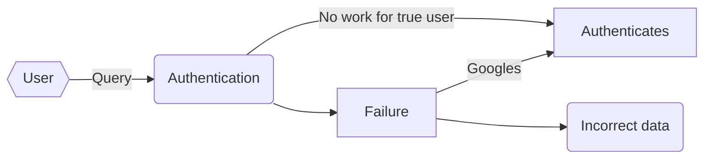

# Cyber Matters

## 5. Authentication 

If you remember from the last post, I'm planning to build a web application that's essentially a data aggregator–it will look for whatever information it can find and then display it. Hopefully it will also provide some other helpful information, but the bulk of the work is the data collection. Of course, there are many other web tools which do very similar work and are frankly amazing in the level of data they're able to find. The main difference between the tool I'm proposing and these is the philosophy behind it. I want this tool to be a proactive cyber security tool for a user to search **him or herself alone**, see what's out there to be found, and then modify his or her behavior based on that feedback, using strategies suggested by the tool. If you look at the webpages of popular people search engines, you'll see phrasing like "[**Know the truth**](https://www.peoplefinders.com/people-search)–learn about someone's criminal history in a flash" or testimonials from users saying things like "I found out my wife was cheating on me in just three minutes with this tool." That is to say, they're very much *offense*-based tools to find out information about other people. The design of these tools reflects that philosophy, offering as much information as possible on as many similar people as possible in an effort to spread the search net wide, so to speak. In contrast, the design of my tool will be tailored to be as restrictive as possible: that is, it won't return information about a user until it is sure that the data in question is actually relevant to the user requesting the data. The question, of course, is how?

#### Zero-Knowledge Assumption Problem

In a traditional authentication paradigm, a user enters secret data (like a username/password combo, for example) into an application, which checks the input data against its own records of what that data should be. Realistically, there are more steps involved (hashing, salting, etc.), but that's the basic gist of it. This relies on a "shared secret" model of authentication. That is, both parties–the application and the user–have access to a certain secret which hopefully no one else but the two of them has. By comparing the values of their secrets, the two reach an understanding that the user (in the common use case) is, in fact, who they say they are. At least, we can be sure that the user has information that the user should have: it's up to the user, of course, to make sure that that data (password) actually does uniquely identify them by practicing good password management techniques. 

In the case of this proposed security tool, though, it's not clear whether or how that paradigm is applicable. My goal is to create a tool which takes in public data (name, home state, etc.) and returns more public data. There's not an obvious shared secret which can guarantee a user's identity to any reasonable degree of certainty. However, there's still a robust need for some kind of authentication because without any authentication at all, a user could just input anyone's name, and, if the tool were to become sophisticated enough, obtain reams of personal data about that person. In later stages of the tool's development, it might even be valuable to show the user if data that is *not* public domain, like social security numbers, for example, is available somewhere online. Even if this didn't happen, though, it's much easier to perpetrate identity theft or fraud with large amounts of data than with just a few points, so we don't want to just blindly give away information to anyone who comes asking. The whole point of the tool is to show a user how much data they're exposing so that they can limit that exposure, not to perpetuate that exposure by giving away data to *anyone* who asks!

Clearly, we need some other model of authentication that fits this markedly different security paradigm. One way that government databases handle similar authentication problems is by using a data-based authentication scheme as follows. 

1. User queries for data
2. Database server finds relevant information
3. Database server queries user with a piece of the data
4. User answers server's query 
5. Database server releases data

Step 3 might not be very clear. Imagine that you sent a query to a tax information database (not usually public record, but just for the example's sake, assume it is). The database server would find the information you asked for, but then it would present you with a question like the following:

| What was your approximate salary in the calendar year 2018? |
| ----------------------------------------------------------- |
| $50,000                                                     |
| $60,000                                                     |
| $80,000                                                     |
| $100,000                                                    |

You would then answer your salary (which you almost certainly know) and the database server would then send the data you asked for. This example is contrived, but I think you get the picture. The idea is that since the user should already know, at least generally, what they're looking for, you can use small pieces of the data they're looking for to make sure they are who they say that are. 

This scheme provides an important level of protection for data that while public, shouldn't necessarily be disclosed willy-nilly. Where it's weak, though, is in its ability to being bypassed through guessing and the possibility that a determined hacker could use these kinds of questions to figure out the data meant to be protected. A multiple-choice scheme is vulnerable to correct guesses, and if your server renders the same question over and over, an attacker could just refresh the page and keep guessing until they got the question right. We also have to think about the context of this particular tool. An attacker using this tool would most likely be looking to use this tool to gather information about a person as quickly and easily as possible. The actual usage of the information will come later using other tools and web pages. Additionally, the attacker could simply gather this data by more conventional means (Google, etc.), so the threshold that an authentication scheme needs to clear is "is it more difficult for an attacker to get data through this tool than it is to find it by Googling and checking?" 

One more consideration is this–it should be very difficult, if not impossible, to figure out whether you've authenticated correctly, other than knowing that the data found is in fact yours. That is, there shouldn't be any notice of failure in authentication. Instead, there should be a dummy screen which provides false data on a failed authentication in order to distract any attackers and lead them astray. This kind of system practices offensive security – that is, security which actively tries to waylay attackers, rather than just fighting off their attacks. The behavior of the authentication system should be as follows:




That is, a user should only be able to move from a false authentication to a true authentication with enough work to make it unreasonable to actually do so. 

#### Scheme

My scheme for this kind of authentication will work like this. It will mimic the query/counter-query structure I described above, except it won't always provide valid questions. That is to say, in some cases, the database will give questions to which there is no right answer: questions in which the user's data isn't actually represented. The chance of the question being valid will decrease with every incorrect answer (with answers to invalid questions not counting) until an attacker is directed to false data once they reach a threshold of incorrect guesses. Of course, there needs to be a little logic to make sure that we don't give the user ```#threshold``` invalid questions in a row, but this isn't hard to do. Likewise, once the user reaches a threshold of correct questions, they'll be provided the real data. The threshold will need to be decided based on experimentation, in order to determine when exactly users grow tired of authentication, balanced of course with sufficient security. A pseudocode implementation of this logic is below.

```
user -> queries database
while #correct responses < threshold:
	database -> queries user
	if correct -> increment #correct responses, give valid question
	otherwise -> decrease chance of valid question, increment #incorrect responses
	
	if #incorrect responses > threshold -> return dummy data

return real_data
```

Now you might be wondering: why waste time with invalid data and decreasing probabilities and yada yada yada? Wouldn't it be simpler to just increase the number of queries, then require some number of correct answers in a row before letting the user in? This would be simple, and it would work pretty well, but it wouldn't be the most secure approach. What this randomization and dummy data gives us is the security that an attacker can't use the questions themselves to gain access to information we're trying to hide. That is, what if you kept refreshing the tool and entering the same query, and then just guessed answers until you figured out which one was right? You also might be able to extrapolate information simply based on what the questions ask, even if you don't gain the exact right answer. Imagine in our salary example above that you didn't know the true answer. You would still gain a minimum and a maximum value possible based on the possible answer options, giving you information you wouldn't have had earlier. This might allow you to guess possible occupations, housing locations, and so on, which might allow you to make it through the quiz. The dummy data and randomization makes it so that the actual question flow provides very little information. What this also gives us is a built-in margin for error. That is, a legitimate user can mess up a couple of times while authenticating (maybe your bank has a different address listed as *most-recent* than you remembered) without locking themselves out. It avoids the draconian nature of a scheme in which the answers to questions must be perfectly entered, out-of-the-blue, every time. 

This scheme, then, avoids the major flaws of a conventional zero-knowledge data-authentication paradigm by using randomization and dummy data to stop hackers from using authentication questions themselves to gain valuable knowledge about a potential victim. Of course, a determined hacker could find the answers to all of our questions because they are, after all, in the public record. This, though, would require at least as much work as conventional search practices, rendering usage of our tool impractical and unnecessary. In essence, the amount of information found by other means is an inverse function of how useful the tool remains, making it impractical for hackers to try to hack this authentication scheme – to do so would just boil down to as much work as bypassing the tool altogether. Now all that's left is to try to implement it. 